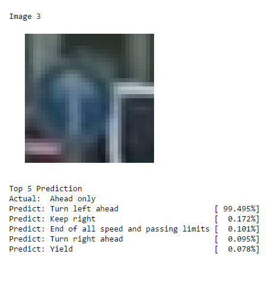

# Traffic Sign Recognition


**Build a Traffic Sign Recognition Project**

The goals / steps of this project are the following:
* Load the data set (see below for links to the project data set)
* Explore, summarize and visualize the data set
* Design, train and test a model architecture
* Use the model to make predictions on new images
* Analyze the softmax probabilities of the new images
* Summarize the results with a written report


## Rubric Points
### Here I will consider the [rubric points](https://review.udacity.com/#!/rubrics/481/view) individually and describe how I addressed each point in my implementation.  

---
### Writeup / README

You're reading it! and here is a link to my [project code](Traffic_Sign_Classifier.ipynb)

### Data Set Summary & Exploration

I used Numpy to calculate overview of the dataset including 

- Number of training and testing data
- Image dimension 
- Number of unique label

Here's how training and testing data look like:

    Number of training examples = 34799
    Number of testing examples = 12630
    Image data shape = (32, 32, 3)
    Number of classes = 43

Below is the snippet that generate the result.

```python
import numpy as np

n_train = y_train.shape[0]
print(y_train)
n_test = y_test.shape[0]
image_shape = X_train[0].shape
n_classes = len(np.unique(y_train))

print("Number of training examples =", n_train)
print("Number of testing examples =", n_test)
print("Image data shape =", image_shape)
print("Number of classes =", n_classes)
```
To explore this dataset further, I ploted sample images from each class and histograms of training dataset and validation set.

Here are a few sample of the result:

#### Sample of Speed-Limit sign


#### Sample of Children Crossing sign


#### Histrogram of Training Data


#### Histrogram of Validating Data


-----------------------------------------------

### Design and Test a Model Architecture

#### Preprocessing input images.

The code for this step is in a function `distorted_input` (contained in the 10th code cell of the IPython notebook).
The preprocessing process performs these three functions in order:
 1. Randomly adjusting contrast using [tf.image.random_contrast](https://www.tensorflow.org/api_docs/python/tf/image/random_contrast)
 2. Randomly adjusting brightness using [tf.image.random_brightness](https://www.tensorflow.org/api_docs/python/tf/image/random_brightness)
 3. Normalized image mean using [tf.image.per_image_standardization](https://www.tensorflow.org/api_docs/python/tf/image/per_image_standardization)

I decided to performing the first two steps because it reflects a real-world lightning condition that can change through out the day. It also artificially increase number of training data and reduce the chance of model "remember" traffic signs. I then normalized to the image to have a zero mean and a unit norm to aid a training process.

#### Batching & Shuffling 
Batching and shuffling is simply done using python array slicing and scikit-learn `shuffle`. The code is in 12th cell of the IPython notebook

#### Model Architecture
My model consists of 4 layers of convolution layers-ELU-Pooling and 3 fully connected layers with 2 dropouts after the first two layers.

Here's my model in detail:

| Layer         		        |     Description	        					| Input Size | Output Size |
|:-----------------------------:|:---------------------------------------------:|:----------:|:-----------:| 
| Input         		        | Input Distortion      						| 32x32x3    | 32x32x3     |
| Convolution       	        | 5x5 ksize, 1x1 stride, same padding          	| 32x32x3    | 28x28x32    |
| LRN 	                        | Local response Normalization                  | 28x28x32   | 28x28x32    |
| RELU     	                    | Exponential Linear Units                    	| 28x28x32   | 28x28x32    |
| Max pooling	      	        | 5x5 ksize, 1x1 stride, valid padding          | 28x28x32   | 24x24x32    |
| Convolution       	        | 4x4 ksize 1x1 stride, same padding           	| 24x24x32   | 21x21x64    |
| LRN 	                        | Local response Normalization                  | 21x21x64   | 21x21x64    |
| RELU     	                    | Exponential Linear Units                    	| 21x21x64   | 21x21x64    |
| Max pooling   	      	    | 4x4 ksize, 1x1 stride, valid padding			| 21x21x64   | 18x18x64    | 
| Convolution         	        | 3x3 ksize, 1x1 stride, same padding           | 18x18x64   | 16x16x72    |
| ELU     	                    | Exponential Linear Units                      | 18x18x64   | 16x16x72    |
| Average pooling	      	    | 3x3 ksize, 2x2 stride, valid padding  	    | 16x16x72   | 7x7x72      |
| Convolution        	        | 2x2 ksize, 1x1 stride, valid padding          | 7x7x72 	 | 6x6x72      |
| ELU     	                    | Exponential Linear Units                     	| 6x6x72     | 6x6x72      |
| Max pooling   	      	    | 2x2 ksize, 2x2 stride, valid padding      	| 6x6x72     | 3x3x128     |
| Flatten                       |                                               | 3x3x128    | 1152        |
| Fully connected		        |           									| 1152       | 256         |
| RELU                          | Rectified Linear Unit                         | 256        | 256         |
| Drop Out                      | Keep rate 0.5                                 | 256        | 256         |
| Fully connected		        |         									    | 256        | 128         |
| RELU                          | Rectified Linear Unit                         | 128        | 128         |
| Drop Out                      | Keep rate 0.5                                 | 128        | 128         |
| Fully connected		        |            									| 128        | 43          |
| Softmax				        |         									    | 43         | 1           |

The code for my final model is located in the 11th cell of the IPython notebook.


#### Hyper-Parameters

To train the model, I used the Cross Entropy as my cost function and [Adam Algorithm](https://arxiv.org/pdf/1412.6980v8.pdf) as an optimizer. The learning rate, batch size, and epoch are 0.001, 256, and 16 respectively. The choosen model was the one that has lowest error on validation data. Below is a plot that show model accuracy over after each epoch using the setup parameters. Notice it reached at 0.98 after 7 epoch.


#### Process of Finding solution

My final model is a result of trying out different configurations and balancing parameters. I spent majority of my time tried out different extreme setups to understand how different components in a network would reflect the prediction and training time. 

My first model was very shallow--1 Convolution layer and 1 Fully Connected. The problem of this model was that it did not have enough complexity for the task resulting in poor classifying result. So I adjusted it by adding a lot more layers. However that resulted in never ending training. So I changed my goal to finding a number of layers that allows me to iterate quickly yet perform well on the testing data. After several trials and errors, I found that about 17-22 layers is a sweet spot for my hardware setup. After that, I tried out different pooling types, activating units to see how it would affect the predicting and learning speed. 

The keys take away from this experiment are:

- Combining elu/relu and max pooling offers a faster learning comparing to sigmoid and average pool
- Local Response Normalization is also adding contrast to the image and that transfers to faster learning in many cases
- Adam algorithm when use in place of Stochastic Gradient Descent shows converging result at a fast pace without messing with learning rate but notice a longer computation time
- The output size of each layer does not affect the end prediction result much as long as they resemble the same shape (pan out,pan in). So having more is probably gives a better model but requires more training data and more time to train the model
- Dropout layers help reduce over-fitting, but be sure to set a keep rate to 1 when not traning


The code to run the training process is located in the 12th cell of the IPython notebook. 

My final model results were:
* validation set accuracy of 0.982
* test set accuracy of 0.965

-----------------------------------------------
 
### Test a Model on New Images

Here are 5 samples of 36 signs I found on the web that the classifier made wrong predictions:


- The 1st image might be difficult to classify it is blurry with distracting sharp white border.
- The 2nd image is off center.
- The 3rd image is all blurry.
- The 4th is off-center and a white box below
- The 5th is not a clean sign

Here are the sample results of the wrong prediction:

| Image			        |     Prediction	        					| 
|:---------------------:|:---------------------------------------------:| 
| Ahead Only      		| Turn Left Ahead   							| 
| Keep Right     		| Keep Left										|
| No Entry				| Priority road									|
| 70 km/h	      		| End of no passing				 				|
| No Entry      		| Stop              							|

*The code for making predictions on my final model is located in the 14th cell of the Ipython notebook.*

The model was able to correctly guess 25 of the 36 traffic signs, which gives an accuracy of 69.4%. This compares favorably to the accuracy on the test set of 96.5%. That was almost a 30% drops. Looking closer into the prediction result shows that the classifier was able to predict signs that it misclassified at a different angle. This leads me to think that with further preprocessing input and enough training time it should be able to generallized better. However, there are a few predictions that did not resemble one another at all for example "No Entry" and "Priority road". No Entry sign is mostly a red circle with white stripe in the middle while "Priority Road" sign is a white diamond with a yellow diamond in the middle. This kind of misclassify requires more sophisticated technique to troubleshooting and reasoning.

Although, the result drops dramatically on a single guess, the result of 5 guesses (top 5 prediction) does not look so bad. Ihe model was able to correctly classify 33 out of 36 (91.7%). The top 5 was computed using `result = sess.run(topK,feed_dict={x: mySample, keep_prob: 1})` statement (Cell 16th in IPython Notebook). For the most prediction the model was too confident about its answer regardless correct and incorrect answer. Below are prediction results of the first 5 images:


For the first image, the model is cirtain it's a 120km/h speed limit but the 2nd guess is also make sense 100km/h speed limit.


For the second image, the model is not very sure wheter the sign is 80km/h or 50km/h which a probability of 59.16% vs 38.8%. But it was able to predict correctly.



For the third image, the model could not make a right guess though it is very sure. Several things that may contribute to this misclassification is that the sign is out of focus and there s a strong white border in the background.


The forth image is an artificial image. I include this sign as a sanity check that it can generalize. And the result was pretty good. The model is able to say it's a "Traffic Signal" sign with 99% confident.


The last image the model is 100% sure  that the sign is "Turn right ahead"

----------

Lastly, I think it's worth looking at sign 10 as well:


The model couldn't guess it right on the 1st and the 2nd try. However the model got it right on the 3rd try.
From the sequence of guessing reveals that the model indeed use a feature of red triangle feature to make those guesses with an exception on "priority road"


