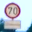

# Traffic Sign Recognition


**Build a Traffic Sign Recognition Project**

The goals / steps of this project are the following:
* Load the data set (see below for links to the project data set)
* Explore, summarize and visualize the data set
* Design, train and test a model architecture
* Use the model to make predictions on new images
* Analyze the softmax probabilities of the new images
* Summarize the results with a written report


## Rubric Points
### Here I will consider the [rubric points](https://review.udacity.com/#!/rubrics/481/view) individually and describe how I addressed each point in my implementation.  

---
### Writeup / README

You're reading it! and here is a link to my [project code](Traffic_Sign_Classifier.ipynb)

### Data Set Summary & Exploration

I used Numpy to calculate overview of the dataset including 

- Number of training and testing data
- Image dimension 
- Number of unique label

Here's how training and testing data look like:

    Number of training examples = 34799
    Number of testing examples = 12630
    Image data shape = (32, 32, 3)
    Number of classes = 43

Below is the snippet that generate the result.

```python
import numpy as np

n_train = y_train.shape[0]
print(y_train)
n_test = y_test.shape[0]
image_shape = X_train[0].shape
n_classes = len(np.unique(y_train))

print("Number of training examples =", n_train)
print("Number of testing examples =", n_test)
print("Image data shape =", image_shape)
print("Number of classes =", n_classes)
```
To explore this dataset further, I ploted sample images from each class and histograms of training dataset and validation set.

Here are a few sample of the result:

#### Sample of Speed-Limit sign


#### Sample of Children Crossing sign


#### Histrogram of Training Data


#### Histrogram of Validating Data


-----------------------------------------------

### Design and Test a Model Architecture

#### Preprocessing input images.

The code for this step is in a function `distorted_input` (contained in the 10th code cell of the IPython notebook).
The preprocessing process performs these three functions in order:
 1. Randomly adjusting contrast using [tf.image.random_contrast](https://www.tensorflow.org/api_docs/python/tf/image/random_contrast)
 2. Randomly adjusting brightness using [tf.image.random_brightness](https://www.tensorflow.org/api_docs/python/tf/image/random_brightness)
 3. Normalized image mean using [tf.image.per_image_standardization](https://www.tensorflow.org/api_docs/python/tf/image/per_image_standardization)

I decided to performing the first two steps because it reflects a real-world lightning condition that can change through out the day. It also artificially increase number of training data and reduce the chance of model "remember" traffic signs. I then normalized to the image to have a zero mean and a unit norm to aid a training process.

Here is an example of an original image and an augmented image:

![alt text][image3]

The difference between the original data set and the augmented data set is the following ... 

#### Batching & Shuffling 
Batching and shuffling is simply done using python array slicing and scikit-learn `shuffle`. The code is in 12th cell of the IPython notebook

#### Model Architecture
My model consists of 4 layers of convolution layers-ELU-Pooling and 3 fully connected layers with 2 dropouts after the first two layers.

Here's my model in detail:

| Layer         		        |     Description	        					| Input Size | Output Size |
|:-----------------------------:|:---------------------------------------------:|:----------:|:-----------:| 
| Input         		        | Input Distortion      						| 32x32x3    | 32x32x3     |
| Convolution       	        | 5x5 ksize, 1x1 stride, same padding          	| 32x32x3    | 28x28x32    |
| LRN 	                        | Local response Normalization                  | 28x28x32   | 28x28x32    |
| ELU     	                    | Exponential Linear Units                    	| 28x28x32   | 28x28x32    |
| Max pooling	      	        | 5x5 ksize, 1x1 stride, valid padding          | 28x28x32   | 24x24x32    |
| Convolution       	        | 4x4 ksize 1x1 stride, same padding           	| 24x24x32   | 21x21x64    |
| ELU     	                    | Exponential Linear Units                    	| 21x21x64   | 21x21x64    |
| Average pooling	      	    | 4x4 ksize, 1x1 stride, valid padding			| 21x21x64   | 18x18x64    | 
| Convolution         	        | 3x3 ksize, 1x1 stride, same padding           | 18x18x64   | 16x16x72    |
| ELU     	                    | Exponential Linear Units                      | 18x18x64   | 16x16x72    |
| Average pooling	      	    | 3x3 ksize, 2x2 stride, valid padding  	    | 16x16x72   | 7x7x72      |
| Convolution        	        | 2x2 ksize, 1x1 stride, valid padding          | 7x7x72 	 | 6x6x72      |
| ELU     	                    | Exponential Linear Units                     	| 6x6x72     | 6x6x72      |
| Average pooling	      	    | 2x2 ksize, 2x2 stride, valid padding      	| 6x6x72     | 3x3x128     |
| Flatten                       |                                               | 3x3x128    | 1152        |
| Fully connected		        |           									| 1152       | 256         |
| RELU                          | Rectified Linear Unit                         | 256        | 256         |
| Drop Out                      | Keep rate 0.5                                 | 256        | 256         |
| Fully connected		        |         									    | 256        | 128         |
| RELU                          | Rectified Linear Unit                         | 128        | 128         |
| Drop Out                      | Keep rate 0.5                                 | 128        | 128         |
| Fully connected		        |            									| 128        | 43          |
| Softmax				        |         									    | 43         | 1           |

The code for my final model is located in the 11th cell of the IPython notebook.


#### Hyper-Parameters

To train the model, I used the Cross Entropy as my cost function and [Adam Algorithm](https://arxiv.org/pdf/1412.6980v8.pdf) as an optimizer. The learning rate, batch size, and epoch are 0.001, 128, and 32 respectively. The choosen model was the one that has lowest error on validation data.

#### Process of Finding solution

My final model is a result of trying out different configurations and balancing parameters. I spent majority of my time tried out different extreme setups to understand how different components in a network would reflect the prediction and training time. 

My first model was very shallow--1 Convolution layer and 1 Fully Connected. The problem of this model was that it did not have enough complexity for the task resulting in poor classifying result. So I adjusted it by adding a lot more layers. However that resulted in never ending training. So I changed my goal to finding a number of layers that allows me to iterate quickly yet perform well on the testing data. After several trials and errors, I found that about 17-22 layers is a sweet spot for my hardware setup. After that, I tried out different pooling types, activating units to see how it would affect the predicting and learning speed. 

The keys take away from this experiment are:

- Combining elu/relu and max pooling offers a faster learning comparing to sigmoid and average pool
- Local Response Normalization is also adding contrast to the image and that transfers to faster learning in many cases
- Adam algorithm when use in place of Stochastic Gradient Descent shows converging result at a fast pace without messing with learning rate but notice a longer computation time
- The output size of each does not affect the end prediction result much as long as they resemble the same shape (pan out,pan in). So having more is probably gives a better model but requires more training data and more time to train the model
- Dropout layers help reduce over-fitting, but be sure to set a keep rate to 1 when not traning


The code to run the training process is located in the 12th cell of the IPython notebook. 

My final model results were:
* validation set accuracy of 0.982
* test set accuracy of 0.965

-----------------------------------------------
 
### Test a Model on New Images

Here are 5 out of 36 signs I found on the web:





The first image might be difficult to classify because ...

####2. Discuss the model's predictions on these new traffic signs and compare the results to predicting on the test set. Identify where in your code predictions were made. At a minimum, discuss what the predictions were, the accuracy on these new predictions, and compare the accuracy to the accuracy on the test set (OPTIONAL: Discuss the results in more detail as described in the "Stand Out Suggestions" part of the rubric).

The code for making predictions on my final model is located in the tenth cell of the Ipython notebook.

Here are the results of the prediction:

| Image			        |     Prediction	        					| 
|:---------------------:|:---------------------------------------------:| 
| Stop Sign      		| Stop sign   									| 
| U-turn     			| U-turn 										|
| Yield					| Yield											|
| 100 km/h	      		| Bumpy Road					 				|
| Slippery Road			| Slippery Road      							|


The model was able to correctly guess 4 of the 5 traffic signs, which gives an accuracy of 80%. This compares favorably to the accuracy on the test set of ...

####3. Describe how certain the model is when predicting on each of the five new images by looking at the softmax probabilities for each prediction and identify where in your code softmax probabilities were outputted. Provide the top 5 softmax probabilities for each image along with the sign type of each probability. (OPTIONAL: as described in the "Stand Out Suggestions" part of the rubric, visualizations can also be provided such as bar charts)

The code for making predictions on my final model is located in the 11th cell of the Ipython notebook.

For the first image, the model is relatively sure that this is a stop sign (probability of 0.6), and the image does contain a stop sign. The top five soft max probabilities were

| Probability         	|     Prediction	        					| 
|:---------------------:|:---------------------------------------------:| 
| .60         			| Stop sign   									| 
| .20     				| U-turn 										|
| .05					| Yield											|
| .04	      			| Bumpy Road					 				|
| .01				    | Slippery Road      							|


For the second image ... 
